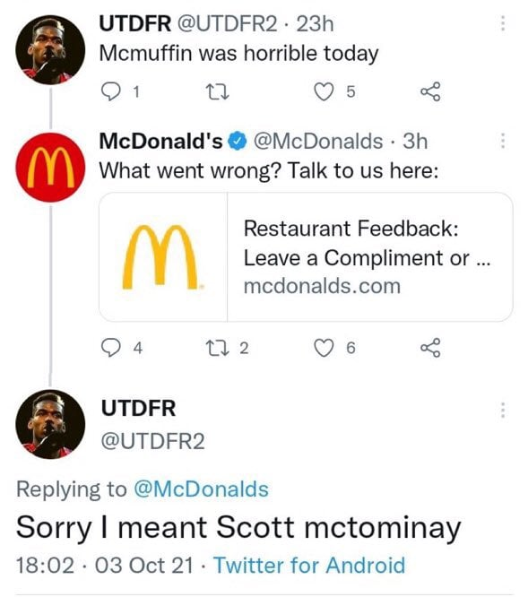
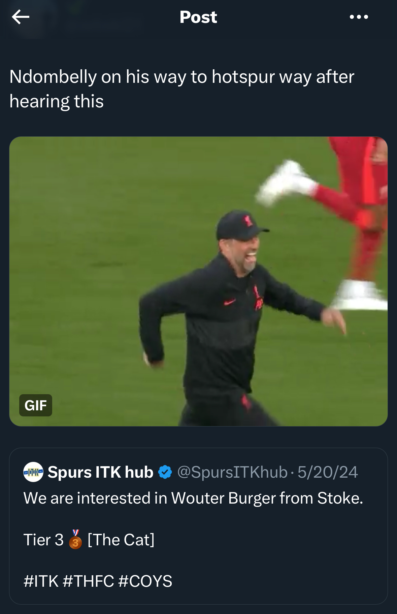
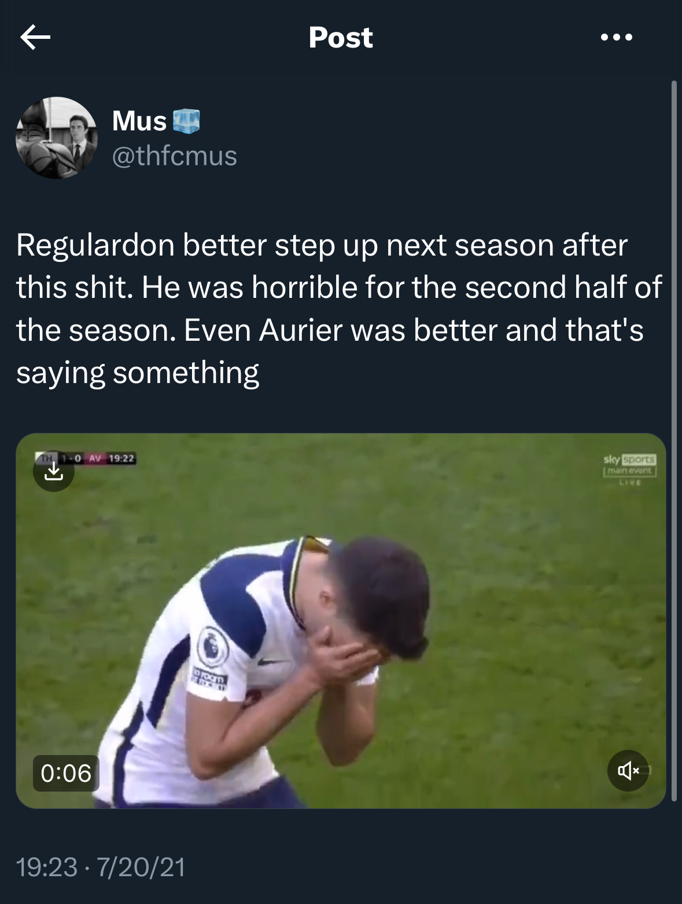

# An Investigation into the use of Player Nicknames amongst Premier League fans

### Potential Aims
* To study the *generation* of nicknames - who is this a nickname of, and what is the probability that this nickname belongs to this player? Onomastics.
* Classifying affectionate vs non-affectionate / derogatory nicknames - nicknames can have sentiment too, potentially depending on the circumstances.
  * When are affectionate vs derogatory nicknames used? Plays into in-group vs out-group dynamics - does the in-group refer to players of their team in a derogatory way if that player is performing poorly?
  * I'm very interested in the use of slander names - this is something that I personally have seen only on Twitter. Names such as *Ndombelly*, *McMuffin*, *Dohertitties*, etc. It makes sense that these are primarily used when that player is performing poorly - more specifically, they tend to be used by the in-group when their own player is performing poorly.

    McTominay -> *McMuffin*
    

        
    

    Ndombele -> *Ndombelly*
    

        
    

    Reguilon -> *Regulardon*
    

        
    

* How does nickname generation differ across cultures? 
  * South American cultures in particular have interesting means of nicknaming - the nickname may look nothing like the original name (e.g. *El Pombo* for Richarlison Andrade, *Chicharito* for Javier Hernandez)
  * In the UK, it is more common to add an -s or -y at the end of the name (e.g. *Madders*)

---

### Data Sources
* I am doing a preliminary analysis (?) using the dataset of tweets from Spurs fans that I collected for my final project in LIN 371. I've noticed that these tweets are longer and definitely more meaningful than the replies I scraped from all parent tweets. Moving forward, it might be a much better decision to determine some accounts who I know for sure are fans of a certain club and tweet primarily about that club. These tweets tend to be more analytical than the replies, which are more reactionary and emotional. 